# Flashy-backdoor

Code for the master's thesis Flashy Backdoor: Real-World Environment Backdoor Attack on SNNs with DVS cameras.

A guide to the code is available [here](how_to.md).

## Examples
### Static triggers
|      Polarity 0        |      Polarity 1          |      Polarity 2          |      Polarity 3          |
|---	|---	|---	|---	|
|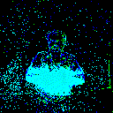 | 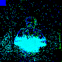 	| 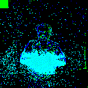 	|  	|

### Framed triggers
|      Polarity 0        |      Polarity 1          |      Polarity 2          |      Polarity 3          |
|---	|---	|---	|---	|
| |  	|  	|  	|

### Strobing triggers
|      Polarity 0        |      Polarity 1          |      Polarity 2          |      Polarity 3          |
|---	|---	|---	|---	|
| |  	|  	|  	|
### Flashy triggers
|      Polarity 0        |      Polarity 1          |      Polarity 2          |      Polarity 3          |
|---	|---	|---	|---	|
| |  	|  	|  	|
#### Physical environment

|       Clean           |      Flashlight Trigger         |       Laser Pointer Trigger          |
|------------------	|---	|---	|
| 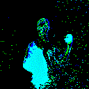 	|   |  	|

## GradCam samples
### Clean model
|      Sample          |      Target class         |      Layer 1         |       Layer 2          |       Layer 3          |       Layer 4          |
|------------------	|--- |---	|---	|---	|---	|
|   Clean 	  |   Real 	      |  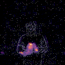 | 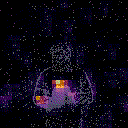 	| 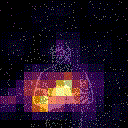 	| 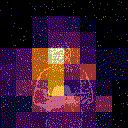 	|
|   Clean 	  |   Backdoor 	  |   |  	|  	|  	|
|   Poisoned 	|   Real 	      |  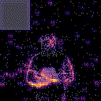 | 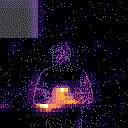 	| 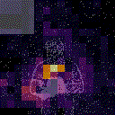 	|  	|
|   Poisoned 	|   Backdoor 	  |   |  	|  	| 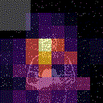 	|

### Backdoored model
|      Sample          |      Target class         |      Layer 1         |       Layer 2          |       Layer 3          |       Layer 4          |
|------------------	|--- |---	|---	|---	|---	|
|   Clean 	  |   Real 	      |   |  	|  	| 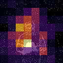 	|
|   Clean 	  |   Backdoor 	  |  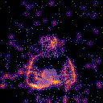 | 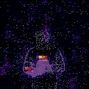 	| 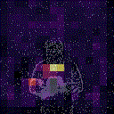 	|  	|
|   Poisoned 	|   Real 	      |  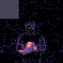 |  	| 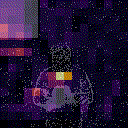 	| 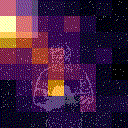 	|
|   Poisoned 	|   Backdoor 	  |   | 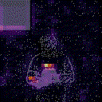 	|  	|  	|

## Authors

Roberto Riaño, Gorka Abad, and Ekaitz Jauregi.

## License

This project is licensed under the MIT License - see the [LICENSE](LICENSE) file for details.
