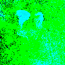
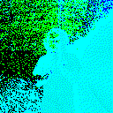

# Flashy-backdoor

Code for the master's thesis Flashy Backdoor: Real-World Environment Backdoor Attack on SNNs with DVS cameras.

A guide to the code is available [here](how_to.md).

## Examples
### Static triggers

### Framed triggers

### Strobing triggers

### Flashy triggers

#### Physical environment

|       Clean           |      Flashlight Trigger         |       Laser Pointer Trigger          |
|------------------	|---	|---	|
|  	|   |  	|

## Authors

Roberto Riaño, Gorka Abad, and Ekaitz Jauregi.

## License

This project is licensed under the MIT License - see the [LICENSE](LICENSE) file for details.
