# Flashy-backdoor

Code for the paper Flashy Backdoor: Real-World Environment Backdoor Attack on SNNs with DVS cameras.

A guide to the code is available [here](how_to.md).

## Outline of the repository

├── flashy_backdoor
│   ├── LICENSE
│   ├── README.md
│   ├── artifact
│   │   ├── data
│   │   ├── BadExpert.py
│   │   ├── autoencoderTrain.py
│   │   ├── autoencoderUse.py
│   │   ├── datasets.py
│   │   ├── do_grad.py
│   │   ├── dynamic.py
│   │   ├── explorer.ipynb
│   │   ├── feebrus.py
│   │   ├── gradCamPatch.py
│   │   ├── gradcam.py
│   │   ├── main.py
│   │   ├── model.pthbase.pth
│   │   ├── models.py
│   │   ├── newFinalAutoencoderPatchSuperBig2L1.pth
│   │   ├── npzToFrames.py
│   │   ├── poisoned_dataset.py
│   │   ├── poisoned_dataset_februus.py
│   │   ├── singleSample.py
│   │   ├── strip.py
│   │   ├── utils.py
│   │   └── visuals.py
│   ├── claims
│   │   ├── claim1_flashy_dvs128
│   │   │   ├── expected
│   │   │   ├── claim.txt
│   │   │   └── run.sh
│   │   ├── claim2_attack_compare
│   │   │   ├── expected
│   │   │   ├── claim.txt
│   │   │   └── run.sh
│   │   ├── claim3_physical_transfer
│   │   │   ├── expected
│   │   │   ├── claim.txt
│   │   │   └── run.sh
│   │   ├── claim4_defense_finepruning
│   │   │   ├── expected
│   │   │   ├── claim.txt
│   │   │   └── run.sh
│   │   ├── claim5_strip_entropy
│   │   │   ├── expected
│   │   │   ├── claim.txt
│   │   │   └── run.sh
│   │   ├── claim6_Badexpert
│   │   │   ├── expected
│   │   │   ├── claim.txt
│   │   │   └── run.sh
│   │   └── claim7_februus
│   │       ├── expected
│   │       ├── claim.txt
│   │       └── run.sh
│   ├── how_to.md
│   ├── infrastructure
│   │   ├── README.md
│   │   ├── access
│   │   │   └── ssh.txt
│   │   └── access.txt
│   ├── install.sh
│   ├── requirements.txt
│   └── use.txt
├── requirements.txt
└── user_reviewer.txt

## Examples
### Static triggers
|      Polarity 0        |      Polarity 1          |      Polarity 2          |      Polarity 3          |
|---	|---	|---	|---	|

|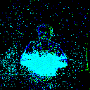 | 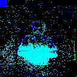 	| 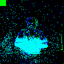 	|  	|

### Framed triggers
|      Polarity 0        |      Polarity 1          |      Polarity 2          |      Polarity 3          |
|---	|---	|---	|---	|

| |  	|  	|  	|

### Strobing triggers
|      Polarity 0        |      Polarity 1          |      Polarity 2          |      Polarity 3          |
|---	|---	|---	|---	|

| |  	|  	|  	|
### Flashy triggers
|      Polarity 0        |      Polarity 1          |      Polarity 2          |      Polarity 3          |
|---	|---	|---	|---	|

| |  	|  	|  	|
#### Physical environment

|       Clean           |      Flashlight Trigger         |       Laser Pointer Trigger          |
|------------------	|---	|---	|

| 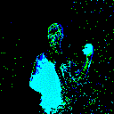 	|  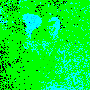 | 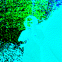 	|

## GradCam samples
### Clean model
|      Sample          |      Target class         |      Layer 1         |       Layer 2          |       Layer 3          |       Layer 4          |
|------------------	|--- |---	|---	|---	|---	|

|   Clean 	  |   Real 	      |  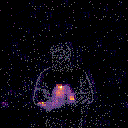 | 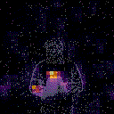 	|  	|  	|

|   Clean 	  |   Backdoor 	  |   |  	| 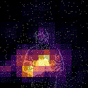 	| 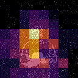 	|

|   Poisoned 	|   Real 	      |  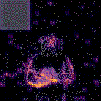 |  	|  	| 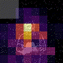 	|

|   Poisoned 	|   Backdoor 	  |   | 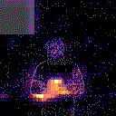 	| 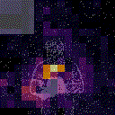 	|  	|

### Backdoored model
|      Sample          |      Target class         |      Layer 1         |       Layer 2          |       Layer 3          |       Layer 4          |

|------------------	|--- |---	|---	|---	|---	|

|   Clean 	  |   Real 	      |  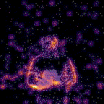 | 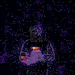 	| 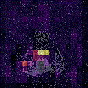 	| 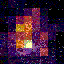 	|

|   Clean 	  |   Backdoor 	  |   |  	|  	|  	|

|   Poisoned 	|   Real 	      |   |  	| 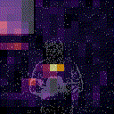 	| 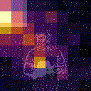 	|

|   Poisoned 	|   Backdoor 	  |  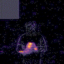 | 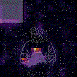 	|  	|  	|

## License

This project is licensed under the MIT License - see the [LICENSE](LICENSE) file for details.
